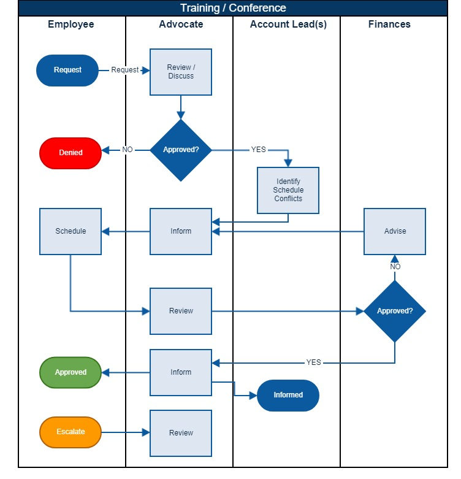

## Training Policy

At Infinity Works we have a collection of proven industry experts, each with many years’ practical, hands-on experience in leading organisations around the globe. We pride ourselves in being practitioners at the coalface day in, day out. Our training service helps leverage this experience and knowledge into your team, helping to build capability and forge long lasting relationships with credible experts in their field.

Training is offered as either scheduled public courses, often with industry recognised certifications, or bespoke training, coaching and mentoring tuned to meet your specific needs.

- Employee discusses possible training with advocate. 
  Examples are classroom training, conference attendance, time out for self-paced learning

- First training event each year will usually be approved

- Second and subsequent events should provide wider benefit to clients and / or the company

- No hard limit on the number of events each year

- Proposals as in form as follows:

I believe that _attending or being certified in specific skill / capability_, _a positive benefit will be achieved_
We will know we have succeeded when we see _measurable outcome_

eg:

I believe that attending a Scrum Master course and achieving certification, will allow me to act as a credible Scrum Master role and assist in training and coaching these roles
We will know we have succeeded when we see me assigned in a Scrum Master, Agile Coach role and playing an active role in Scrum Master training

I believe that by becoming a Scrum Certified Professional, it will allow me to provide training and coaching at all levels of Scrum delivery, both internally and externally

We will know we have succeeded when we see me providing internal and external training to staff and clients

- Advocates are empowered to approve training but discuss with other advocates to ensure fair levelling

- Your Advocate will liaise with your Account Manager to help to identify dates that conflict with key deliverables and provide to the employee

- The employee will seek a suitable course on a suitable date, though your Advocate can assist in this

- Once a date is found, your Advocate will work with finance to ensure there are no financial obstacles from booking the course (cashflow, etc), although we expect these to be rare

- Should you be denied training that you feel you can justify, please escalate to either your Advocate or The Leeds Board.

Training Approval Process 
